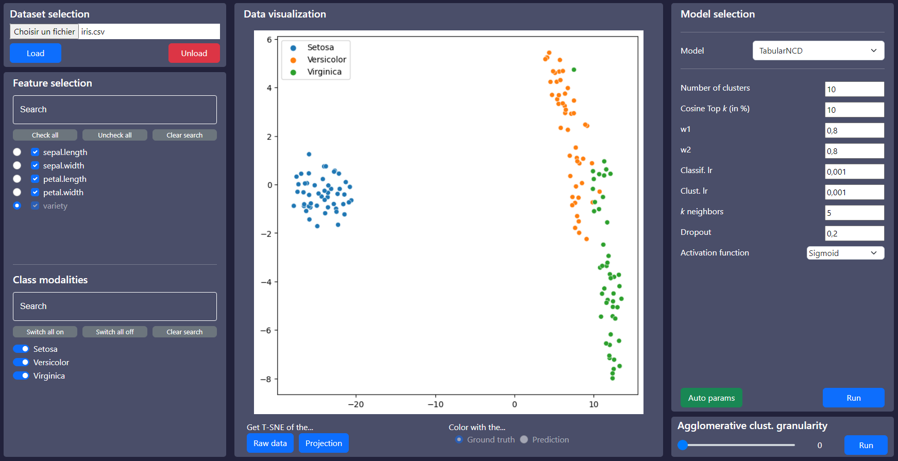

# Interactive Clustering

Simple web interface to interact with various clustering algorithms and display their results.

**Note:** The backend uses the port 5000 and the frontend uses the port 3000.

**/!\ Datasets must be placed in ./datasets/... and cannot be loaded from other folders.**

## The interface




## Installation

1) Clone the repository in the [Git Bash](https://git-scm.com/downloads) with `git clone https://gitlab.tech.orange/exploration-des-dnis/interactiveclustering`

2) Set up the Python 3.10.9 virtual environment for the backend with [Anaconda](https://docs.anaconda.com/anaconda/install/index.html):
```bash
cd backend
# Create the virtual environment with conda
conda env create --file environment.yml --prefix ./icvenv
# Activate the virtual environment
conda activate .\icvenv
# Check if torch supports GPU (you need CUDA 11 installed)
python -c "import torch; print(torch.cuda.is_available())"
```

3) Start the backend:
```bash
python server.py
```

4) Install [Node.js](https://nodejs.org/en/) for the frontend website.

5) Build the website and run it with:

```bash
cd frontend
npm install
npm start
```

At this point, the backend python server is running, and the frontend website should be accessible on http://localhost:3000/
