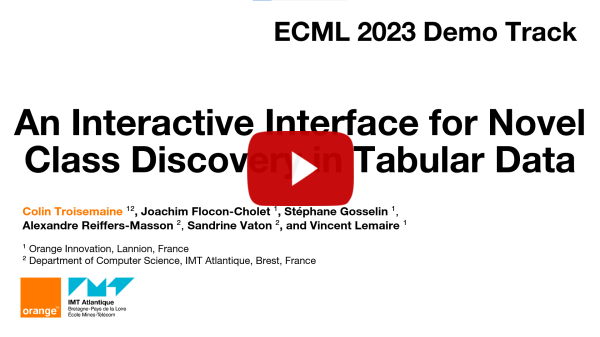

# Interactive Clustering

[](https://opensource.org/licenses/MIT)

This application proposes a simple web interface designed to assist the user in solving the Machine Learning problem of [Novel Class Discovery](https://arxiv.org/pdf/2302.12028.pdf).

With this interface, the user can:
<ol>
  <li>Load a CSV dataset.</li>
  <li>Select which features to use in the dataset, and indicate which is the class feature.</li>
  <li>Choose to remove some classes from the dataset by unchecking them and select which classes are considered as known or unknown.</li>
  <li>Visualize the data in 2 dimensions by running a T-SNE. There is an option to view only the unknown classes for easier readability. Clicking on a point displays all its attributes.</li>
  <li>Configure and execute 3 NCD models and 2 unsupervised clustering algorithms. The models currently implemented are:
    <ol>
      <li>PBN (see https://arxiv.org/pdf/2311.05440)</li>
      <li>TabularNCD (see https://arxiv.org/pdf/2209.01217)</li>
      <li>A baseline model described in the two previous papers</li>
      <li>$k$-means and Spectral Clustering</li>
    </ol>
  </li>
  <li>Get an interpretable description of the results by training a decision tree to classify the known classes and the discovered clusters.</li>
</ol>

PBN, TabularNCD and the baseline rely on an architecture composed of a combination of dense layers, dropout and activation functions which can all be modified through the interface (even the sizes and number of hidden layers).

Finally, we note that because Python code cannot be directly executed in a web browser, this application is split in two: a frontend application in React.js to display the interface, and a backend application in Flask to execute the Python code.
Additionally, web browsers security measures make it impossible to read the full path from file selector. Thus, **datasets must be placed in ./datasets/... and cannot be loaded from other folders.**


## The interface


## Demonstration video for ECML 2023

<a href="http://www.youtube.com/watch?feature=player_embedded&v=W7ru8NHPj-8&cc_load_policy=1" target="_blank">
 
</a>


## Installation

**/!\ Warning:**
Installation wont work behind the **proxy** and on the **intranet**.
It is advised to deactivate the proxy and connect to a wifi with full internet access.


1) Clone the repository in the [Git Bash](https://git-scm.com/downloads) with `git clone https://github.com/ColinTr/InteractiveClustering`

2) Install [Anaconda](https://docs.anaconda.com/anaconda/install/index.html) and open it **in administrator**:
```bash
cd backend
# Create the virtual environment with conda
conda env create --file environment.yml --prefix ./icvenv
# Activate the virtual environment
conda activate .\icvenv
# Check if torch supports GPU (you need CUDA 11 installed)
python -c "import torch; print(torch.cuda.is_available())"
```

3) Start the backend:
```bash
python server.py
```

4) Install [Node.js](https://nodejs.org/en/).

5) Open cmd **in administrator**:

```bash
cd frontend
npm install
npm start
```

At this point, the backend python server is running, and the frontend website should be accessible on http://localhost:3000/

**Note:** The backend uses the port 5000 and the frontend uses the port 3000.


## Citation
If you found this work useful, please use the following citation:
```
@inproceedings{tr2023interface,
   title = {An Interactive Interface for Novel Class Discovery in Tabular Data},
   author = {Troisemaine, Colin and Flocon{-}Cholet, Joachim and Gosselin, St{'{e}}phane and Reiffers{-}Masson, Alexandre and Vaton, Sandrine and Lemaire, Vincent},
   booktitle = {Machine Learning and Knowledge Discovery in Databases: Applied Data Science and Demo Track},
   volume = {14175},
   pages = {295--299},
   publisher = {Springer},
   year = {2023},
   doi = {10.1007/978-3-031-43430-3\_18},
}
```

## License

Copyright (c) 2024 Orange.

This code is released under the MIT license. See the LICENSE file for more information.

This application uses the CUDA Toolkit. The CUDA Toolkit is subject to the NVIDIA End User License Agreement (EULA).
Please review the NVIDIA EULA at https://docs.nvidia.com/cuda/eula/index.html.
