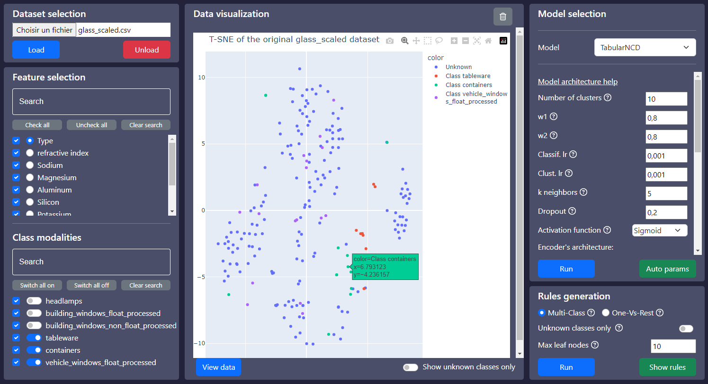

# InteractiveClustering

Simple web interface to interact with various clustering algorithms and display their results.

**Note:** The backend uses the port 5000 and the frontend uses the port 3000.

## Installation

1) Clone the repository by running `git clone https://github.com/ColinTr/InteractiveClustering`

2) Setup the [Python 3.10.6](https://www.python.org/downloads/release/python-3106/) virtual environment for the backend:
```bash
python -m venv backend/venv
```
```bash
# For Windows:
backend\venv\Scripts\activate
# For Linux/Mac:
source backend/venv/bin/activate
```
```bash
python -m pip install -r requirements.txt
```

3) Start the backend:
```bash
python backend/server.py
```

4) *ToDo : describe the process for starting the React.js client*

## Use


